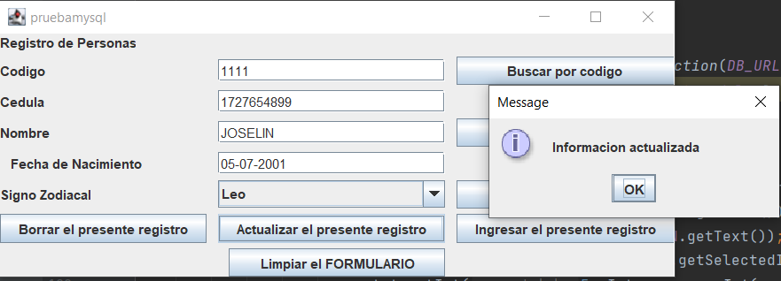

# Coreccion de la prueba con MYSQL

Juan Falconi

Conexion con el MySql

Para lograr la conexion debemos instalar el jdbc de sqlServer e importar
en la libreria del Intellij Idea una vez realizado eso debemos de colocarnos en database
y dar las credenciales ya sea de windows o con un usuario y contraseña.

Insertamos los datos en el sql server para realizar el crud

Para realizar la busqueda por codigo necesitamos buscar en la tabla persona 
con el codigo para mostrar la informacion de nombre signo fecha y la cedula.

Para buscar por nombre se realiza lo mismo solo que en el select vamos a tener que poner
el nombre a buscar es?
Para que nos muestre la demas informacion

Para el signo como lo pasamos como parametro string seria la busqueda como el nombre.

Para la actualizacion del registo se realiza mediante el codigo si encuentra el codigo se realiza el cambio caso contrario no.

Al momento de eliminar un registo se necesita colocar bien los paramatros 
que en este caso el codigo es el que tiene que coincidir con la base de datos.

El ingreso de un nuevo registro se realiza con la informacion colocadas en las casillas correspondientes
ademas que en tiene que ser con un insert dentro de la tabla personas.

.

LIEMPIEZA DE FORMULARIO
